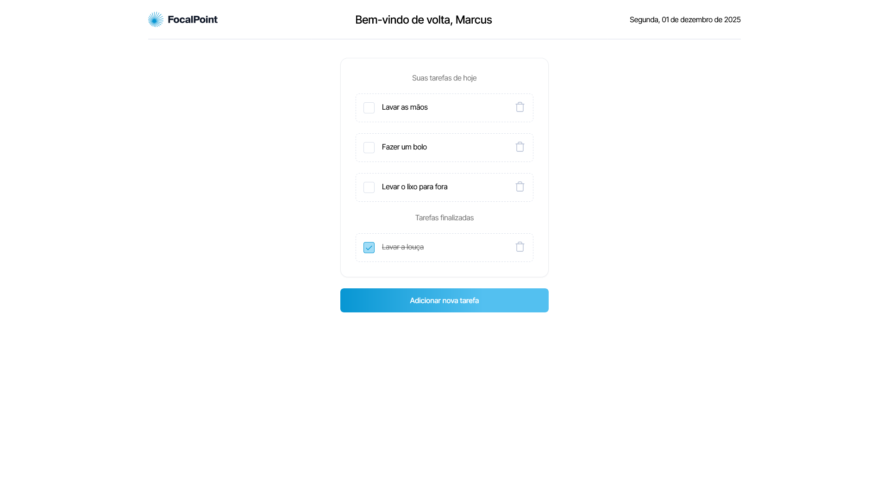

# <a href="https://legaplan-two.vercel.app/" target="_blank">Teste Dev Júnior - Legaplan</a>

Este projeto é uma aplicação de lista de tarefas (Todo List) desenvolvida em Next.js e Sass. Ele foi criado como parte de um teste técnico para uma vaga de Desenvolvedor Frontend Júnior na Legaplan. A aplicação possui funcionalidades de adição, exclusão e marcação de tarefas como concluídas, com um design responsivo e interação via modais.

<a href="https://legaplan-two.vercel.app/" target="_blank">
    
</a>

## Tecnologias Utilizadas

Este projeto utiliza as seguintes tecnologias:

- Next.js - Framework React para renderização no lado do servidor e front-end
- TypeScript - Superset do JavaScript com tipagem estática
- Sass (SCSS) - Pré-processador CSS para estilização
- React Hooks - useState, useCallback e custom hooks para gerenciamento de estado e lógica

## Dependências e Versões Necessárias

Para rodar o projeto, você vai precisar das seguintes dependências instaladas no seu ambiente:

- Node.js - Versão: 16.x ou superior
- npm ou yarn - Gerenciador de pacotes

Além disso, você pode consultar as dependências do projeto no arquivo package.json.

## Como rodar o projeto ✅

Siga os passos abaixo para rodar a aplicação em seu ambiente local:

1. Clone o repositório:

```
git clone https://github.com/felipe-Ma1a/legaplan.git
```

2. Acesse o diretório do projeto:

```
cd legaplan
```

3. Instale as dependências:

```
npm install
# ou
yarn install
```

4. Instale as dependências:

```
npm run dev
# ou
yarn dev
```

5. Acesse a aplicação no navegador em http://localhost:3000.
   </br></br>

Você deverá ver a aplicação de Todo List rodando, onde é possível adicionar, excluir e marcar tarefas como concluídas.

## 📌 Funcionalidades da Aplicação

A aplicação permite as seguintes operações:

- Adicionar Tarefa: Clicando no botão "Adicionar nova tarefa", um modal será aberto permitindo a criação de uma nova tarefa.
- Excluir Tarefa: Clicando no ícone de lixeira ao lado de uma tarefa, um modal será aberto pedindo confirmação para excluir a tarefa.
- Marcar Tarefa como Concluída: Clicando em uma tarefa na lista de tarefas ativas, ela será movida para a lista de tarefas concluídas.

## ⏭️ Próximos passos

Abaixo estão algumas ideias que podem ser implementadas no futuro para melhorar a aplicação:

- Implementar testes automatizados: Adicionar testes usando Jest e React Testing Library para garantir a qualidade e estabilidade do código.
- Autenticação de usuários: Implementar login de usuários para permitir que cada usuário tenha sua própria lista de tarefas.
- Persistência de dados: Criar uma API ou utilizar uma solução de armazenamento para salvar as tarefas em um banco de dados.

##

Gostaria de agradecer ao Lucas e ao Marcus pela oportunidade de participar deste teste técnico e de mostrar minhas habilidades como desenvolvedor frontend. Foi uma experiência enriquecedora e desafiadora, que me ajudou a crescer profissionalmente.
